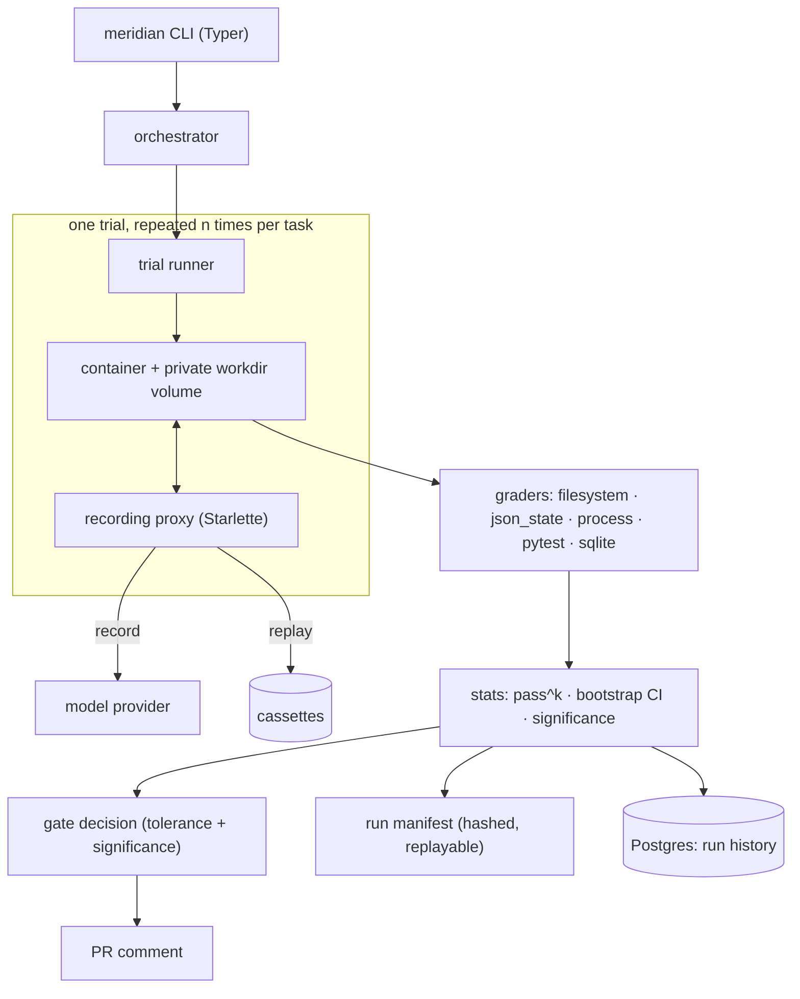

# Meridian

**An agent evaluation harness that answers one question: did this change make my agent better or worse,
and can I reproduce that answer tomorrow?**

Most agent evaluation reports a single accuracy number from a single pass. That number moves when
nothing changed, because agents are stochastic, because one trial leaves state behind for the next, and
because the model provider was slower today. Meridian is built so that the number means something: every
trial is isolated, every run is replayable from a hashed manifest, and a regression only blocks a merge
when it clears both a tolerance and a significance test.

```
run run-1787356196-99fa46 — suite checkout-agent v1
status: complete  n=5  k=3

task                      pass     n   pass@3   pass^3
────────────────────────────────────────────────────────────
expired-coupon               4     5     1.00     0.40
expired-on-bulk-order        4     5     1.00     0.40
expiry-boundary              4     5     1.00     0.40
happy-path                   4     5     1.00     0.40
missing-field                5     5     1.00     1.00
stale-coupon                 4     5     1.00     0.40
unknown-coupon               4     5     1.00     0.40
────────────────────────────────────────────────────────────
suite pass^3                                     0.49
95% CI (over tasks)                      [0.40, 0.66]
excluded from the aggregate: contamination-probe, contamination-writer
harness error rate: 0.0%
cost: 51c   wall clock: 34.9s
```

Note the gap between `pass@3` and `pass^3` in that table. Six of the seven tasks pass at least once in
three attempts, which is what `pass@3` reports and it reads as a perfect 1.00. `pass^3` asks whether the
agent passes *all three* times, and the same six tasks score 0.40. An agent you would ship is described
by the second number, not the first.

---

## Who this is for

Anyone maintaining an LLM agent who has to decide whether to merge a prompt change, a tool change, or a
model swap. It is aimed at the moment where "it seems better" is not a good enough answer and rerunning
the eval twice gives two different results.

Not a leaderboard, and not a benchmark suite. Meridian runs *your* tasks against *your* agent and tells
you whether today's version regressed against the merge base.

---

## What it does

**Per-trial isolation.** Every trial gets a fresh container and its own workdir volume. This is asserted,
not assumed: the suite ships a contamination probe that writes a marker in one trial and checks for it in
the next, and CI runs it in both directions.

```
$ meridian run --suite checkout-agent --include-probes
  contamination-writer     pass
  contamination-probe      pass

$ meridian run --suite checkout-agent --include-probes --unsafe-shared-env
  contamination-writer     pass
  contamination-probe      fail  /work/marker.txt exists but should not — 18 bytes of state that should not be reachable
```

A probe that cannot fail proves nothing, so the failing direction is asserted alongside the passing one.

**Outcome grading, not string matching.** A task declares what the world should look like when the agent
is done. Graders check filesystem state, JSON state, process exit, pytest results, and SQLite queries.

**`pass^k` with confidence intervals.** Per-task and suite-level `pass^k`, with a bootstrap confidence
interval over tasks and a significance test on the baseline-to-head delta.

**Record and replay.** Agent traffic goes through a local proxy that records provider responses to
cassettes. Replay runs from those cassettes, so CI is offline, costs nothing, and cannot fail because a
provider was slow. `meridian replay <run-id>` re-materializes an archived run from its manifest and
reports whether it reproduced exactly.

**A PR gate that explains itself.** On every pull request the gate runs head against the merge base and
posts a verdict, updating its comment in place rather than appending one per push.

> ## Meridian gate
>
> ✅ **PASS** — suite pass^k moved -0.000 (0.486 → 0.486), within the 0.030 tolerance
>
> | | baseline | head |
> |---|---|---|
> | suite pass^3 | 0.486 | 0.486 |
>
> `n=5` · `k=3` · status `complete` · harness errors 0.0% · cost 51c
>
> <sub>head run `run-1787356294-4b4069` · baseline run `run-1787356251-11c99a` · manifest
> `sha256:eecdd3318c8dfd31…` · reproduce with `meridian replay run-1787356294-4b4069`</sub>

Full examples: [`docs/demo/gate-comment-pass.md`](docs/demo/gate-comment-pass.md),
[`docs/demo/gate-comment-fail.md`](docs/demo/gate-comment-fail.md),
[`docs/demo/run-report.html`](docs/demo/run-report.html).

---

## Architecture



The manifest is the load-bearing piece. It pins the suite version, the environment image digest, the
harness version, the commit, and the cassette set, and it is content-hashed. `meridian replay` rebuilds a
run from it and reports drift, which is a correctness check on the harness rather than a convenience:
drift means something outside the manifest moved, and the manifest needs to capture it.

---

## Quick start

Requires Python 3.12 or 3.13, Docker, and [uv](https://docs.astral.sh/uv/).

```bash
git clone https://github.com/patsypppe/meridian.git
cd meridian
cp .env.example .env          # replay mode needs no API key
make sync                     # uv sync from the lockfile
make check                    # ruff + mypy --strict + unit tests
```

Build the environment images and run the bundled suite:

```bash
make images                   # builds the checkout env and the proxy, repins the suite
meridian run --suite ./suites/checkout-agent --n 5 --k 3 --proxy-mode replay
```

Reproduce any archived run:

```bash
meridian runs                 # list archived runs
meridian replay <run-id>      # re-materialize it and report replay fidelity
```

Run the gate locally against a baseline commit:

```bash
meridian gate --suite ./suites/checkout-agent \
  --baseline-ref origin/main \
  --n 5 --k 3 --tolerance 0.03 --require-significance \
  --proxy-mode record
```

Every Make target is self-documenting:

```bash
make help
```

| Target | What it does |
|---|---|
| `make sync` | install dependencies from the lockfile |
| `make lint` | ruff check and format check |
| `make typecheck` | `mypy --strict` over `src/meridian` |
| `make unit` | pure-logic tests, no Docker, no network |
| `make integration` | Docker-backed tests |
| `make e2e` | full run, replay, and gate against the fixture agent |
| `make check` | lint + typecheck + unit, the gate every commit must pass |
| `make images` | rebuild the environment and proxy images and repin the suite |
| `make db` | start Postgres and run `alembic upgrade head` |
| `make sweep` | remove containers a crashed run left behind |

---

## Configuration

Copy `.env.example` to `.env`. No secrets belong in the repository.

| Variable | Purpose |
|---|---|
| `ANTHROPIC_API_KEY` | Needed **only** for a cassette recording pass. Replay runs, and therefore CI, never read it. |
| `MERIDIAN_DATABASE_URL` | Postgres connection string. The compose service publishes on 5433 to avoid colliding with a local Postgres. |
| `MERIDIAN_PROXY_MODE` | `record`, `replay`, or `passthrough`. `passthrough` is rejected by config validation in gate mode. |

---

## Testing

Tests are tiered by what they need and how long they take, and the markers are enforced with
`--strict-markers`.

```bash
make unit           # pure logic, no Docker, no network      (< 5s)
make integration    # requires the Docker daemon             (< 3min)
make e2e            # full run/replay/gate, fixture agent    (< 10min)
```

On a clean clone, `make check` currently reports: ruff clean, ruff format clean across 97 files,
`mypy --strict` clean across 66 source modules, and **226 unit tests passing in 2.3 seconds**.

The suite includes a corpus of deliberately invalid suite fixtures, so validation is tested on inputs
that should be rejected rather than only on inputs that should pass, plus a golden manifest and its
expected hash so canonicalization changes cannot slip through unnoticed.

---

## Continuous integration

Two workflows, both in [`.github/workflows`](.github/workflows).

`ci.yml` runs three dependent jobs: **static** (ruff lint, ruff format check, `mypy --strict`, unit
tests), then **integration** against a Postgres 17 service container with `alembic upgrade head`, then
**e2e**. No API key is present in any job, because e2e replays from committed cassettes.

`gate.yml` runs the harness against itself on every pull request. Two details in it are the ones worth
copying: `fetch-depth: 0`, because merge-base resolution silently returns nothing on a shallow clone and
the gate then quietly has no baseline forever; and `if: always()` on the comment step, because a failing
gate that posts no explanation is a red X that developers disable.

---

## Design decisions

**`pass^k`, not `pass@k`.** `pass@k` rewards an agent that gets it right once in k attempts. That is the
right metric for code search and the wrong one for a system you intend to run unattended. `pass^k` asks
for k successes out of k, which is what "reliable" means.

**Record and replay rather than live calls in CI.** A gate that calls a provider is a gate that is
sometimes red because of the provider. Recording once and replaying afterwards makes the check free,
offline, and deterministic. The gate itself records rather than replays, because it measures the agent as
it is now and cassettes from the previous version would miss on every changed prompt.

**Isolation asserted, not assumed.** Shared state between trials is the most common way an eval quietly
becomes wrong, and it is invisible in the results. Hence a probe with a deliberate failing direction.

**Tolerance and significance both.** Either alone produces a bad gate. Tolerance alone blocks on noise;
significance alone blocks on differences too small to care about.

**Postgres for history, files for runs.** A single run has to be portable and diffable, so it is a
manifest on disk. Trend over time is a query, so it goes in a database. Neither is the source of truth
for the other.

---

## Project layout

```
src/meridian/
  cli.py            Typer entry point
  runtime/          orchestrator, trial runner, proxy (server, session, stand-in provider)
  grading/graders/  filesystem, json_state, process, pytest, sqlite
  stats/            pass^k, bootstrap confidence intervals, significance
  gate/             baseline comparison and merge verdict
  manifest/         run manifests, canonicalization, hashing
  snapshots/        environment image build and digest pinning
  store/            Postgres repository and Alembic migrations
  report/           HTML and terminal run reports
suites/             task suites (bundled: checkout-agent)
envs/               environment images (checkout, proxy)
fixtures/           the fixture agent and recorded cassettes
tests/              unit, integration, e2e, and invalid-suite fixtures
```

---

## Current limitations

This is honest about where it is, because a harness that overstates its own reliability is
self-refuting.

- **One bundled suite.** `checkout-agent` is a synthetic task suite written to exercise the harness.
  Nothing here has been validated against a production agent.
- **One adapter.** The proxy is written against an Anthropic-shaped API. Other providers need an adapter.
- **Local execution only.** Trials run against the local Docker daemon. There is no distributed runner
  and no remote execution backend.
- **Cassette staleness is not detected automatically.** If the agent's prompts change, recorded cassettes
  miss and you must re-record. The gate sidesteps this by recording, but ad-hoc replay runs do not warn.
- **Cost accounting is approximate**, derived from token counts reported by the provider.
- **The stats assume tasks are independent.** The bootstrap resamples over tasks, which is wrong if two
  tasks exercise the same failure mode.

---

## Roadmap

Near term, in the order it matters:

1. A second provider adapter, to prove the proxy boundary is actually a boundary.
2. Suite authoring documentation, so the bundled suite is an example rather than the only instance.
3. Cassette staleness detection with a clear "re-record" error instead of a confusing miss.

---

## Contributing

See [CONTRIBUTING.md](CONTRIBUTING.md). In short: `make check` must pass, `mypy --strict` is not
negotiable, and new behavior needs a test at the cheapest tier that can actually catch it.

---

## License

MIT. See [LICENSE](LICENSE).
